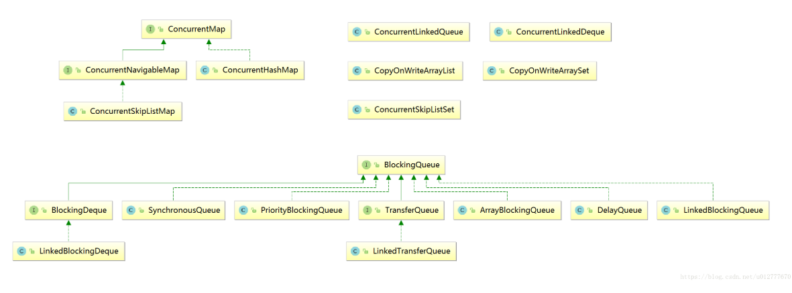

[1.谈谈缓存一致性？](#1)

[2.谈谈java内存模型？](#2)

[3.并发测试工具？](#3)

[4.线程安全性？](#4)

[5.Atomic包？](#4)

[6.CAS](#6)

[7.ABA问题？](#7)

[8.synchronized?](#8)

[9.volitale关键字？](#9)

[10.同步容器和并发容器？](#10)

[11.AQS](#11)

[12. synchronized和lock的区别？](#12)

[13. 线程池](#13)

[14.写一个死锁](#14)

[15. 死锁的必要条件？](#15)


#### <span  id="1">1.谈谈缓存一致性</span>

为了解决i/o和cpu运算速度不匹配的问题，引入了缓存。但由于cpu的运算速度超过了一级缓存的i/o速率，所以引入了多级缓存。如何保证多个缓存数据的一致性，这里引入了一致性协议MESI。它规定了cache line的四种状态。M （modified）：表示数据被修改，要在其它缓存读取该数据前写回主存，变为独享状态 。E（exclusive）：数据和内存中数据一致，一旦有其它缓存读取主存该数据，就变为共享状态 。S（shared）：数据被多个缓存进行缓存，并且数据和内存中数据一致，一旦有其它缓存修改该缓存行的数据，将该缓存行变为无效。 I（invalid）：使该缓存行无效（有其它cpu修改了该缓存行）


### <span id="10">2. 谈谈java内存模型(JMM)？</span>

​	java memory model —— java内存模型，是java线程间通信的机制

​	线程之间共享变量存储在主内存，每个线程都有自己的本地内存，存储的是共享变量在本地的副本


#### <span id="3">3. 并发测试工具？</span>

（1）postman：接口测试 。也可测并发（但并不专业）

（2）Apache Bench（AB）：ab -n 1000 -c 50 http://localhost:8080/test  （1000次请求50次并发）

（3）Jmeter


#### <span id="4">4. 线程安全性？</span>

（1）原子性：同一时刻只能有一个线程操作

（2）可见性：一个线程对主内存的修改可及时被其它线程观察到

（3）有序性：一个线程中指令的执行顺序（由于指令重排序，顺序一般杂乱）


#### <span id="5">5. Atomic包？</span>

Atomic包是Java.util.concurrent下的另一个专门为线程安全设计的Java包,包括多个原子操作类

（1）AtomicInteger：首先atomic变量时volatile修饰的，保证了可见性和有序性。然后通过cas保证了原子性。所以对于它的操作是线程安全的

（2）LongAdder：AtomicInteger在大量修改失败时，这些循环尝试cas，这样性能受到影响。LongAdder高并发时依然能有很好性能


#### <span id="6">6.CAS?</span>

compare and swap。是一种乐观策略，需要三个操作数，内存地址，预期值，即将要更新的目标值。当内存地址的值与预期值相等时才将值修改为目标值，否则什么也不做。并再次进行cas操作


#### <span id="7">7.ABA问题？</span>

在cas操作的时候，其它线程将A改为B再改回A，本线程就认为该值没有变过。与实际不符合

（弊端eg：链表实现的栈，栈顶为A，next为B。要把栈顶更新为B,此时将A B出栈，PUSH进CDA，执行cas操作发现A没变，更新成功，B变为栈顶，但此时B.next为null，并不是CD）

解决方案：AtomicStampedReference 用版本戳来标记变量，更新时版本号+1


#### <span id="8">8. synchronized?</span>

是一种重量级锁，①修饰代码块，作用范围为大括号括起来的代码，作用与调用的对象②修饰方法，作用范围为整个方法，作用于调用的对象③修饰静态方法：作用范围为整个静态方法，作用于这个类的所有对象④修饰类：作用范围，括号括起来的部分，作用于这个类的所有对象


### <span id="11">9.谈谈volatile关键字？</span>

​	一旦一个共享变量（类成员变量，静态成员变量）被volatile修饰后，具备了两层语义：

​	（1）保证不同线程对这个变量操作时的可见性（怎么保证？volatile会强制将修改值立即写入主存，并且使其它线程的工作内存中该值无效，需要重新从主存读取）

​	（2）禁止进行指令重排序

​	（注意：volatile不能保证原子性，因为修改值和写入主内存不是一个原子操作）


#### <span id="10">10. 同步容器和并发容器？</span>

##### 同步容器

（1）含义：通过synchronized来实现同步的容器，比如vector，hashtable

（2）缺点：①并不一定线程安全的，比如get和delete操作，两者不具有原子性（delete last 同时get last导致数组越界异常）

​		     ②串行执行，影响效率

##### 并发容器

（1）含义：concurrent（J.U.C）包下的容器-java.util.concurrent



（2）arrayList——>CopyOnWriteArrayList：当我们往一个容器添加元素的时候，不直接往当前容器添加，而是先将当前容器进行Copy，复制出一个新的容器，然后新的容器里添加元素，添加完元素之后，再将原容器的引用指向新的容器。这样做的好处是我们可以对CopyOnWrite容器进行并发的读，而不需要加锁，因为当前容器不会添加任何元素。思想：读写分离，最终一致性

（3）hashset，treeset——>CopyOnWriteArraySet ConcurrentSkipListSet

（4）hashmap，treemap——>concurrenthashmap，ConcurrentSkipListMap


#### <span id="11">11.AQS</span>

（1）概念：AbstractQueuedSynchronize（抽象队列同步器），构建了一套多线程访问共享资源的同步器框架，许多同步类都依赖于它（如：ReentrantLock，semaphore，CountDownLatch）。维护了一个volatile int state（代表共享资源）和一个FIFO线程等待队列。并定义了两种资源共享方式：Exclusive（独占）和share（共享）。自定义同步器在实现时只需要实现共享资源state的获取（tryAcquire）与释放（tryRelease）方式即可

（2）CountDownLatch：类似于一个计数器的功能，初始化的时候传入一个正整数作为初始值，每次调用countdown方法该值减1，另一个线程调用它的await（）方法会导致该线程阻塞直到该值减为0

（3）Semaphore：是一种计数信号量，通常用于限制可以访问某些资源线程数目。new Semaphore(20)每次最多允许20个线程同时访问。acquire（）获取一个许可 release（）释放一个许可

（4）CyclicBarrier:循环（Cyclic）的屏障（Barrier）。允许一组线程循环等待，直到达到某个公共屏障点。new CyclicBarrier(5);  ----> cyclicBarrier.await();(5个线程后才继续执行)

（5）ReentReadWriteLock：在没有任何读写锁的时候才可以获取写入锁


#### <span id="12">12. synchronized和lock的区别？</span>

​	（1）synchronized遇到异常时自动释放锁，lock不会（所以需要在finally中lock.unlock释放锁）

​	（2）lock可以指定等待时间（lock.trylock(5,TimeUnit.SECOND)）

​	（3）synchronized是java关键字 lock是一个类


#### <span id="13">13.线程池</span>

（1）线程池参数：

​	corePoolSize：核心线程数

​	maximumPoolSize：最大线程数

​	workQueue：阻塞队列，存储等待执行的任务

​	keepAliveTime：线程没有任务执行时最多保持多久时间终止

​	TimeUnit：时间单位

​	rejectHander：当拒绝处理任务时的策略


（2）线程池按以下顺序执行任务：

```
1.当线程数小于核心线程数时，创建线程。
2.当线程数大于等于核心线程数，且任务队列未满时，将任务放入任务队列。
3.当线程数大于等于核心线程数，且任务队列已满
  （1）若线程数小于最大线程数，创建线程
  （2）若线程数等于最大线程数，抛出异常，拒绝任务
```


（3）线程池方法

```
execute（）：提交任务，交给线程池执行
submit（）：提交任务，能够返回执行结果 （execute+Future）
shutdown（）：关闭线程池，等待任务都执行完
shutdownNow（）：关闭线程池，不等待任务执行完
getTaskCount（）：线程池已执行和未执行任务总数
getComplatedTaskCount（）：已完成的任务数量
getPoolSize（）：线程池当前线程数量
getActiveCount（）：线程池正在执行任务数量
```


（4）线程池状态

```
RUNNING:创建线程池并初始化后处于RUNNING状态
SHUTDOWN:调用shutdown（）后处于SHUTDOWN，此时线程池不接收新任务，等待所有任务执行完毕
STOP：调用shutdownNow（）后处于stop状态，此时不接受新的任务，并且回去尝试终止正在执行的任务
TERMINATED:线程池处于SHUTDOWN或STOP，并且工作线程已销毁，任务队列执行完，进入TERMINATED
```


（5）线程池种类

```
①Executors.newCacheThreadPool() 可缓存线程池，先查看池中有没有以前建立的线程，如果有，就直接使用。如果没有，就建一个新的线程加入池中
②Executors.newFixedThreadPool(int n)：创建一个可重用固定个数的线程池，以共享的无界队列方式来运行这些线程
③Executors.newScheduledThreadPool(int n)：创建一个定长线程池，支持定时及周期性任务执行
④Executors.newSingleThreadExecutor()：创建一个单线程化的线程池，它只会用唯一的工作线程来执行任务，保证所有任务按照指定顺序(FIFO, LIFO, 优先级)执行
```


#### <span id="14">14. 写一个死锁</span>

```java
public class DeadLock implements Runnable{
    public int flag = 1;
    private static Object o1 = new Object(),o2 = new Object();
    @Override
    public void run() {
        log.info("flag {}", flag);
        if (flag == 1){
            synchronized (o1){
                try {
                    Thread.sleep(500);
                } catch (InterruptedException e) {
                    e.printStackTrace();
                }
                synchronized (o2){
                    log.info("flag 1 finished");
                }
            }
        }
        if (flag == 0){
            synchronized (o2){
                try {
                    Thread.sleep(500);
                } catch (InterruptedException e) {
                    e.printStackTrace();
                }
                synchronized (o1){
                    log.info("flag 2 finished");
                }
            }
        }
    }

    public static void main(String[] args) {
        DeadLock lock1 = new DeadLock();
        DeadLock lock2 = new DeadLock();
        lock1.flag = 1;
        lock2.flag = 0;
        new Thread(lock1).start();
        new Thread(lock2).start();
    }
}

```


### <span id="18">15. 死锁必要条件？</span>

​	（1）互斥使用，即当资源被一个线程使用(占有)时，别的线程不能使用 

​	（2）不可抢占，资源请求者不能强制从资源占有者手中夺取资源，资源只能由资源占有者主动释放。 

​	（3）请求和保持，即当资源请求者在请求其他的资源的同时保持对原有资源的占有。 

​	（4）循环等待，即存在一个等待队列：P1占有P2的资源，P2占有P3的资源，P3占有P1的资源。这样就形成了一个等待环路。 


#### <span id="16">16. 怎样避免死锁？</span>

```
1.破坏“不可剥夺”条件：一个进程不能获得所需要的全部资源时便处于等待状态，等待期间他占有的资源将被隐式的释放重新加入到 系统的资源列表中，可以被其他的进程使用，而等待的进程只有重新获得自己原有的资源以及新申请的资源才可以重新启动，执行。
2.破坏”请求与保持条件“：每个进程在开始执行时就申请他所需要的全部资源。
3.破坏“循环等待”条件：采用资源有序分配其基本思想是将系统中的所有资源顺序编号，将紧缺的，稀少的采用较大的编号，在申请资源时必须按照编号的顺序进行，一个进程只有获得较小编号的进程才能申请较大编号的进程。
```

